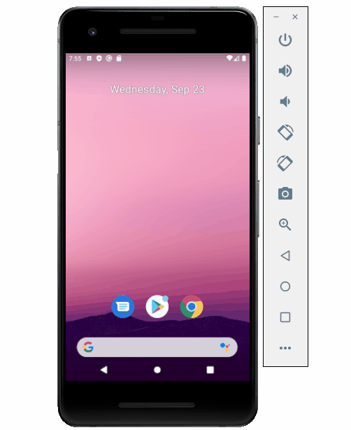
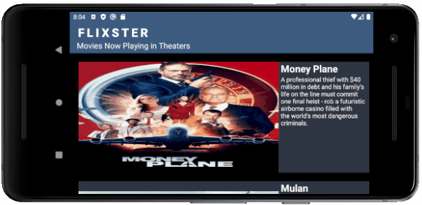

# Flixster
Flixster is an app that allows users to browse movies from the [The Movie Database API](http://docs.themoviedb.apiary.io/#). The app uses the heterogeneous RecyclerView to display the movies playing in the theaters now.

## Checkpoint 2

### Features
- [x] Expose details of movie (ratings using RatingBar, popularity, and synopsis) in a separate activity.
- [x] Allow video posts to be played in full-screen using the YouTubePlayerView.
- [x] Implement a shared element transition when user clicks into the details of a movie.
- [x] Trailers for popular movies are played automatically when the movie is selected.
  - [x] When clicking on a popular movie (i.e. a movie voted for more than 7 stars) the video should be played immediately.
  - [x] Less popular videos rely on the detailed page should show an image preview that can initiate playing a YouTube video.
- [x] Add a play icon overlay to popular movies to indicate that the movie can be played.
- [x] Apply data binding for views to help remove boilerplate code. Check [activity_movie_details.xml](https://github.com/Sha5hwati/Android/blob/0fef0225e2f2297f592c4a5bdf82925edb5da6a5/Flixster/app/src/main/res/layout/activity_movie_details.xml#L20))
- [x] Add a rounded corners for the images using the Glide transformations.

### App Walkthough GIF

 

## Checkpoint 1

### Features
- [x] User can view a list of movies (title, poster image, and overview) currently playing in theaters from the Movie Database API.

- [x] Views should be responsive for both landscape/portrait mode.
   - [x] In portrait mode, the poster image, title, and movie overview is shown.
   - [x] In landscape mode, the rotated alternate layout should use the backdrop image instead and show the title and movie overview to the right of it.

- [x] Display a nice default placeholder graphic for each image during loading.
- [x] Improved the user interface by experimenting with styling and coloring.
- [x] For popular movies (i.e. a movie with more than 7 average vote), the full backdrop image is displayed. Otherwise, a poster image, the movie title, and overview is listed.
- [x] Added an app icon

#### App Walkthough GIF

  
 
## Open-source libraries used

- [Android Async HTTP](https://github.com/codepath/CPAsyncHttpClient) - Simple asynchronous HTTP requests with JSON parsing
- [Glide](https://github.com/bumptech/glide) - Image loading and caching library for Androids